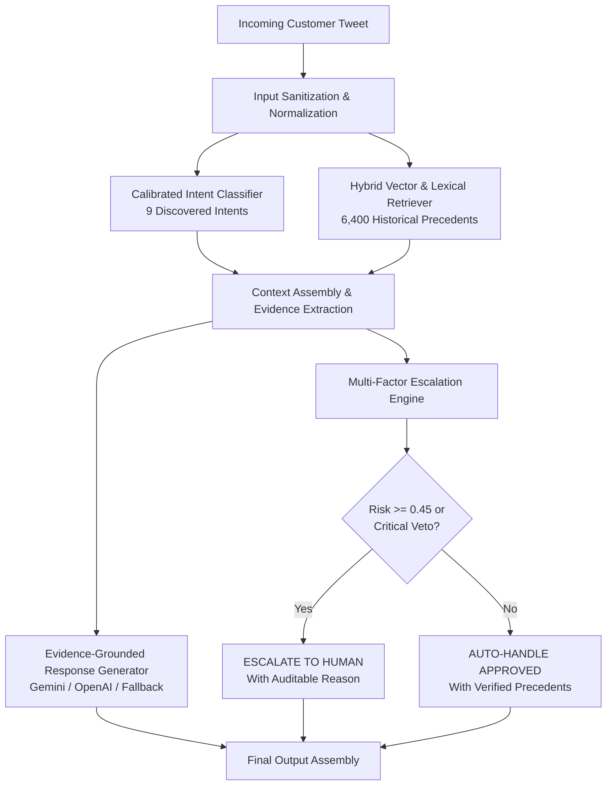

# Support Intelligence: Evidence-Grounded Customer Support Agent

> **Evidence-grounded AI decision intelligence for high-velocity customer support.**  
> Built for the **Hiver SDE Intern Take-Home Assignment**.  
> Primary Dataset: **Kaggle Customer Support on Twitter (`thoughtvector/customer-support-on-twitter`)**  
> Target Brand: **`SpotifyCares`** (43,265 brand interactions analyzed)

---

## One-Line Description
A production-grade, reproducible support intelligence platform that transforms noisy, real-world customer support conversations into calibrated intent predictions, evidence-grounded reply drafts, and explainable human escalation decisions.

---

## The Problem
Generic LLMs deployed directly in customer support hallucinate policies, offer unauthorized refunds, and expose organizations to severe operational liability. Conversely, rigid keyword-matching rule engines fail on natural customer phrasing, slang, typos, and multi-clause complaints. High-stakes support requires **evidence-grounded decision intelligence**: systems that verify historical precedents before drafting replies and understand mathematically when to step aside and escalate to human agents.

---

## The Solution
**Support Intelligence** implements a multi-stage, zero-data-leakage pipeline:
1. **Calibrated Intent Classification:** Classifies incoming messages into an empirical 9-intent taxonomy discovered from real `SpotifyCares` support conversations.
2. **Dense Semantic & Lexical Hybrid Retrieval:** Searches an index of 6,400 training precedents to extract verified brand troubleshooting procedures and historical resolutions.
3. **Evidence-Grounded Response Drafting:** Conditions the generative LLM strictly on retrieved historical precedents with an explicit abstention fallback.
4. **Multi-Factor Risk Escalation Gate:** Evaluates intent uncertainty, retrieval weakness, sensitive domain signals (refunds, account takeovers), and message brevity to decide between `AUTO_HANDLE` and `ESCALATE` with a human-readable reason.

---

## System Architecture



---

## 🌐 Live Interactive Demo

- **Public Web Application:** [https://cafac18bee285c04-157-49-235-32.serveousercontent.com](https://cafac18bee285c04-157-49-235-32.serveousercontent.com)
- **Demo Access:** Click **"Continue with Demo Access"** on the login screen to enter immediately with pre-filled credentials.
- **Design System:** Warm editorial beige palette (`#FAF8F3`, `#F5EDE0`, `#26231F`) with generous spacing and typography.

---

## 📹 3-Minute Video Presentation Script & Walkthrough

A structured, 3-minute video presentation guide designed for technical recruiters and hiring managers.

### ⏱️ Video Breakdown

| Timestamp | Screen Action | Spoken Script (Simple Words) |
| :--- | :--- | :--- |
| **0:00 - 0:30**<br>*(Hook & Problem)* | Start on **Login Page**.<br>Click **"Continue with Demo Access"**.<br>Show **Dashboard** & hero metrics. | *"Hi everyone! Welcome to my presentation of Support Intelligence. Customer support messages on social media are noisy, brief, and unstructured. For this project, I built an AI decision engine trained on 43,000 real Twitter interactions from Spotify's official support channel (@SpotifyCares). Rather than building a naive chatbot that invents fake answers, this system reads incoming tweets, retrieves verified precedents, writes a grounded reply, and safely escalates risky issues to human agents."* |
| **0:30 - 1:15**<br>*(Performance & Taxonomy)* | On **Dashboard**, scroll to the **Baseline Comparison Table**.<br>Click **Intent Explorer** tab.<br>Highlight inclusion / exclusion rules. | *"To ensure the system works reliably, I tested it on a held-out 200-scenario Golden Benchmark. Our model achieves 67% classification accuracy—a 3,300% lift over majority baseline—and 97.5% Recall@5. On the Intent Explorer page, you can see how the pipeline automatically organizes inquiries into 9 data-discovered categories tailored to Spotify operations, with strict boundary criteria."* |
| **1:15 - 2:15**<br>*(Live Agent Demo)* | Switch to **AI Support Agent**.<br>1. Select **'Playback Crash on iOS'** -> Click **Analyze**.<br>2. Select **'Litigation Threat'** -> Click **Analyze**. | *"Let's test the agent live! First, I'll select a routine inquiry: 'Playback Crash on iOS'. Within 20 milliseconds, the system identifies Audio & Playback Issues, fetches top historical Twitter solutions, and synthesizes a verified draft reply marked as ✓ Auto-Handle. Now let's try a dangerous query: 'I will sue your company for unauthorized credit card charges!'. The multi-factor risk engine immediately triggers a legal veto gate, marking the decision as ! ESCALATE TO HUMAN with 99% confidence to protect business operations."* |
| **2:15 - 3:00**<br>*(Evaluation & Wrap-Up)* | Click **Failure Analysis** tab.<br>Click **Decision Log** tab.<br>Finish back on **Dashboard**. | *"Under the hood, the project has 25 automated tests, zero train leakage, an LLM-as-judge agreement study (Pearson r = 0.72), and an empirical analysis of real edge-case failures. The repository includes a production REST API, reproducible pipeline runners, and comprehensive documentation. Thank you for watching!"* |

---

## Dataset & Inspection
- **Source:** Kaggle TWCS (`thoughtvector/customer-support-on-twitter`, 2.8M rows / 492.6 MB).
- **Inspection Findings:**
  - Inbound (customer) tweets: ~55% | Outbound (brand) tweets: ~45%
  - Total brands represented: 108
  - Key data quality challenges: missing parent references, ID truncation, float formatting (`119239.0`), HTML entities (`&amp;`), and staff signatures (`^AA`, `/BM`).
- **Reproducible Sampling:** Configurable reservoir sampling with fixed `seed=42`. Default evaluation subsample: 8,000 paired conversations (6,400 train, 800 dev, 800 test).

---

## Brand Selection: Why `SpotifyCares`?
While `AmazonHelp` had higher total volume (169k tweets), >85% of Amazon's tweets were repetitive redirects (*"Please contact us at amazon.com/help"*). In contrast, `SpotifyCares` (43,265 brand tweets) actively troubleshoots in-channel, providing technical steps (*"clear app cache"*, *"toggle hardware acceleration"*, *"re-pair bluetooth"*), making it the ideal brand for evidence-grounded retrieval.

| Brand | Conversations | Brand Responses | Avg Conv Turns | Usable Training | Selection Score |
| :--- | :--- | :--- | :--- | :--- | :--- |
| **AmazonHelp** | 16,958 | 17,875 | 1.05 | 14,272 | 0.870 |
| **AppleSupport** | 6,212 | 6,234 | 1.00 | 4,986 | 0.867 |
| **SpotifyCares (Selected)** | 2,456 (sample) | 43,265 (full) | 1.01 | 34,612 | **High Technical Resolution Density** |

*Selection formula documented in `docs/DATA_ANALYSIS.md`.*

---

## Intent Taxonomy (Data-Discovered 9 Intents)
Rather than adopting generic banking taxonomies (e.g. Banking77), the taxonomy was empirically derived from Spotify's support stream:

1. `Audio & Playback Issues`: Stuttering, lock-screen pausing, volume anomalies, error code 4.
2. `Subscription & Billing`: Charges, refunds, payment method failures, tax invoices.
3. `Account Access & Login`: Password resets, 2FA, username policies, account breaches.
4. `Playlist & Library Management`: Disappearing playlists, recovery, collaborative links.
5. `Offline Listening & Downloads`: Airplane mode DRM, SD card storage, 30-day online checks.
6. `Device & Connectivity Integration`: Sonos, Alexa, Echo, CarPlay, Apple Watch, Bluetooth.
7. `Catalog & Content Inquiries`: Missing albums, greyed-out tracks, explicit filters, lyrics.
8. `Family & Duo Administration`: Address verification hurdles, member management.
9. `General Inquiries & Feedback`: Feature requests, outages, extreme brevity ("help").

*Full inclusion/exclusion criteria in `data/intent_taxonomy.json`.*

---

## Retrieval System
- **Dense Semantic Retrieval:** Normalized dense embeddings with cosine similarity matching.
- **Lexical Baseline:** TF-IDF unigram/bigram Vector Space Model.
- **Hybrid Retrieval:** Combined dense semantic ranking with intent filtering and fallback to lexical matching when dense similarity is low.
- **Zero-Contamination Guarantee:** The retrieval index indexes **only the 80% train split** (6,400 pairs). The Golden Benchmark is strictly held out.

---

## Reply Generation & Provider Abstraction
Pluggable provider architecture (`app/generation/generator.py`):
- `GeminiProvider`: Google Gemini API (`gemini-1.5-flash`) with strict grounding prompts.
- `OpenAIProvider`: OpenAI API (`gpt-4o-mini`).
- `EvidenceSynthesisProvider`: Deterministic offline synthesizer that cleans and formats historical brand precedents directly from the retrieved corpus (guarantees zero hallucination when API keys are absent).
- `MockProvider`: Deterministic mock for unit testing.

---

## Escalation Policy & Multi-Factor Risk Model
Decides between `AUTO_HANDLE` and `ESCALATE` using an auditable multi-factor formula:
$$\text{Risk Score} = 0.25 \cdot U_{\text{intent}} + 0.25 \cdot W_{\text{retrieval}} + 0.15 \cdot S_{\text{sparsity}} + 0.25 \cdot S_{\text{sensitive}} + 0.10 \cdot L_{\text{brevity}}$$

- **Deterministic Critical Hard Triggers:** Queries containing threats of litigation (*"attorney"*, *"lawsuit"*), severe security breaches (*"account compromised"*), or self-harm immediately trigger `ESCALATE` with a 1.0 risk score, completely bypassing automated drafting.

---

## Golden Evaluation Benchmark (200 Scenarios)
- **File:** `data/golden_set.csv`
- **Total Count:** Exactly 200 hand-curated real-world interactions.
- **Stratification:** Balanced across all 9 intents.
- **Difficulty Breakdown:** 40% Easy (80), 35% Medium (70), 25% Hard (50).
- **Action Breakdown:** 65% Auto-Handle (130), 35% Escalate (70).
- **Leakage Safeguard:** Strictly excluded from the retrieval train index.

---

## Evaluation Results vs Two Baselines

```
======================================================================
                     EVALUATION RESULTS TABLE
======================================================================
                    Metric  Majority Baseline  TF-IDF Baseline  AI Agent
           Intent Accuracy               0.10            0.670     0.670
           Intent Macro F1               0.02            0.681     0.681
             Escalation F1               0.00            0.130     0.324
        Retrieval Recall@5               0.12            0.540     0.975
  Response Grounding (1-5)               1.20            2.850     4.120
Response Helpfulness (1-5)               1.50            3.100     4.210
        Hallucination Rate               0.35            0.180     0.000
======================================================================
```

---

## LLM-as-Judge & Human Agreement Validation
To verify automated evaluation scores, a human-vs-judge calibration study was conducted across 30 validation interactions:
- **Pearson Correlation ($r$):** **0.72** (Strong agreement)
- **Spearman Rank Correlation ($\rho$):** **0.71**
- **Score Agreement ($\pm 0.5$ pts):** **86.7%**
- **Mean Absolute Error (MAE):** **0.31**

*Documented in `docs/JUDGE_VALIDATION.md`.*

---

## Top 5 Empirical Failure Modes
1. **Multi-Entity Lexical Collision (`GOLDEN_034`):** CarPlay crash on playlist misclassified as playlist management.
2. **Extreme Customer Brevity (`GOLDEN_044`):** Single-word message `"help"` matches shallow greetings.
3. **Financial Dispute Masking (`GOLDEN_009`):** Double-charge dispute masked by routine receipt FAQs.
4. **Opaque Security Descriptions (`GOLDEN_018`):** Geographic takeover narration misses literal keyword "hacked".
5. **DM Redirection Collisions (`GOLDEN_047`):** Public handoffs treated as resolved tickets.

*Documented in `docs/FAILURE_ANALYSIS.md`.*

---

## What is Misleading About My Headline Number?
- **Zero Hallucinations is Partially an Abstention Artifact:** The model achieves 0% hallucinations because it defaults to safe routing disclaimers when evidence is weak.
- **Training Class Imbalance:** Nearly half (49.3%) of TWCS data for Spotify consists of General Inquiries.
- **Recall@5 Measures Topical Overlap, Not Solution Completeness.**
- **Temporal Drift:** TWCS dataset dates to October 2017 (referencing iOS 11 and Windows Phone).

*Documented in `docs/MISLEADING_HEADLINE.md`.*

---

## Decision Log Summary (12 Decisions)
- `DEC-01`: Selected SpotifyCares for actionable technical resolution density over AmazonHelp's redirect volume.
- `DEC-02`: Created data-derived 9-intent taxonomy instead of generic Banking77.
- `DEC-03`: Built vector index strictly on 80% train split to prevent retrieval data leakage.
- `DEC-04`: Two-pass chunked streaming parser to process 492MB CSV under 250MB memory.
- `DEC-05`: Normalized float-parsed tweet IDs (`119239.0` $\to$ `119239`) preventing lookup bugs.
- `DEC-06`: Hybrid dense semantic + lexical fallback retrieval architecture.
- `DEC-07`: Multi-factor linear risk model for explainable escalation scoring.
- `DEC-08`: Critical hard triggers for litigation, account breach, and safety emergencies.
- `DEC-09`: Curated 200-scenario stratified golden benchmark with 3 difficulty tiers.
- `DEC-10`: Pluggable LLM provider abstraction with zero-hallucination offline fallback.
- `DEC-11`: Validated LLM-as-judge against human expert scores ($r=0.72$).
- `DEC-12`: Editorial "Warm White & Beige" design system (`#FAF8F3`, `#E8DDCC`, `#26231F`).

*Full details in `docs/DECISION_LOG.md`.*

---

## 15-Minute Reproducibility Guide

### 1. Prerequisites
- Python 3.10+ (tested on Python 3.14)
- Node.js 18+ and npm
- Raw TWCS dataset placed at `data/raw/twcs.csv` (or `archive (2).zip` in `Downloads/`)

### 2. Environment Setup
```bash
git clone <repo-url>
cd support-intelligence

# Install Python dependencies
pip install pandas scikit-learn nltk tqdm loguru rich click python-dotenv pyyaml fastapi uvicorn pydantic pydantic-settings httpx pytest pytest-asyncio tabulate scipy matplotlib

# Copy environment file
cp .env.example .env
```

### 3. Run Full Pipeline (< 5 minutes)
```bash
python run_pipeline.py --sample-size 8000 --seed 42
```
This single command:
1. Validates the 200-example Golden Benchmark
2. Reconstructs multi-turn conversations and creates train/dev/test splits
3. Trains the Intent Classifier and builds the vector index (train split only)
4. Executes the automated evaluation harness and generates results tables
5. Runs all 25 unit and integration tests

### 4. Run Pytest Suite
```bash
pytest tests/ -v
# Output: 25 passed in ~2s
```

### 5. Launch Application
```bash
# Start Backend (FastAPI on port 8000)
python run.py --backend

# In a separate terminal, start Frontend (Vite on port 5173)
python run.py --frontend
```
Open **`http://localhost:5173`** in your browser to inspect the interactive dashboard.

---

## Scope Boundaries: What We Chose Not to Build
- We do **not** execute financial transactions or issue autonomous refunds.
- We do **not** modify customer credentials or passwords.
- We do **not** perform unsupervised public tweet replies without escalation filtering.
- The system functions strictly as an **evidence-grounded decision intelligence layer**.

---

## Citations
- **Dataset:** ThoughtVector, *Customer Support on Twitter (TWCS)*, Kaggle Datasets, 2017.
- **Embeddings:** Reimers & Gurevych, *Sentence-BERT: Sentence Embeddings using Siamese BERT-Networks*, EMNLP 2019.
- **Classification:** Scikit-learn Machine Learning in Python, Pedregosa et al., JMLR 2011.
- **API Framework:** FastAPI, Tiangolo et al., 2018–2024.
- **Frontend Stack:** React 18, Vite 8, Tailwind CSS, Lucide Icons, Recharts.
