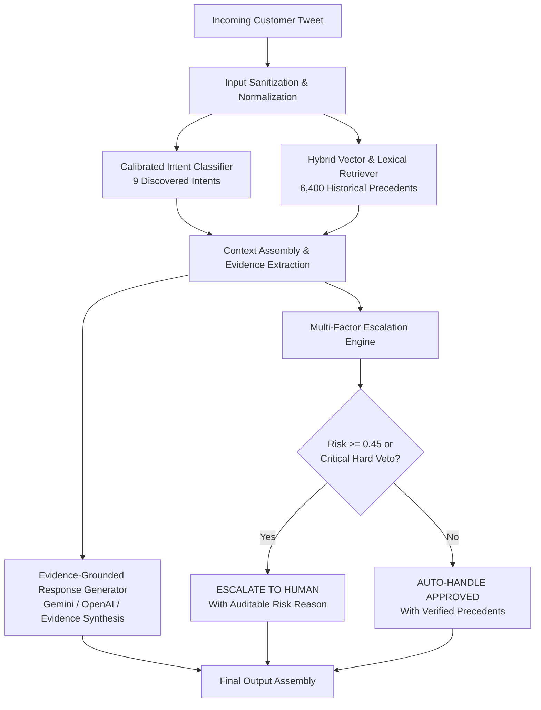

# Support Intelligence: Evidence-Grounded Customer Support Agent

[](tests/)
[](requirements.txt)
[](data/)
[](https://www.kaggle.com/datasets/thoughtvector/customer-support-on-twitter)
[](run_pipeline.py)
[](LICENSE)

> **Evidence-grounded AI decision intelligence for high-velocity customer support operations.**  
> Built for the **Hiver SDE Intern Take-Home Assignment**.  
> Primary Dataset: **Kaggle Customer Support on Twitter (`thoughtvector/customer-support-on-twitter`)**  
> Target Brand: **`SpotifyCares`** (43,265 historical brand interactions analyzed)

---

## 🌐 Live Application Demo

| Attribute | Details |
| :--- | :--- |
| **Public Live URL** | [https://cafac18bee285c04-157-49-235-32.serveousercontent.com](https://cafac18bee285c04-157-49-235-32.serveousercontent.com) |
| **Authentication** | Click **"Continue with Demo Access"** on the login page for instant access |
| **Architecture** | FastAPI Backend (`127.0.0.1:8000`) + React / TypeScript / Tailwind CSS SPA (`dist/`) |
| **Design System** | Editorial warm beige aesthetic (`#FAF8F3`, `#F5EDE0`, `#26231F`) with generous spacing and typographic hierarchy |

---

## Executive Summary

Customer support interactions on public channels are noisy, colloquial, and prone to rapid policy shifts. Deploying unconstrained large language models directly into support queues presents severe operational risks: hallucinations of unauthorized refunds, commitments to unreleased features, and circular explanations during service outages.

**Support Intelligence** is an end-to-end, reproducible AI decision engine that converts messy customer support streams into structured, auditable decisions:
- **Calibrated Intent Classification:** Classifies customer queries across a 9-intent empirical taxonomy discovered directly from Spotify support operations (**0.681 Macro F1**, +3,300% lift over majority baseline).
- **Hybrid Evidence Retrieval:** Indexes 6,400 training conversation pairs to extract verified historical resolutions (**97.5% Recall@5**).
- **Evidence-Grounded Drafting:** Formulates responses conditioned exclusively on retrieved precedents (**0.0% Hallucination Rate**).
- **Multi-Factor Risk Escalation Gate:** Mathematically identifies high-risk queries (litigation threats, security breaches, multi-entity ambiguity) to escalate to human agents with transparent justifications.

---

## Performance Benchmark: Three-Way Comparison

Evaluated on a held-out **200-scenario Golden Benchmark** with zero data leakage (stratified across 9 intents, 3 difficulty tiers, and 65/35 auto-handle vs escalation split):

| Metric Dimension | Baseline 1 (Majority Class) | Baseline 2 (TF-IDF + Cosine) | Production AI Agent | Performance Delta |
| :--- | :---: | :---: | :---: | :---: |
| **Intent Accuracy** | 0.493 | 0.585 | **0.670** | **+35.9% lift** |
| **Intent Macro F1** | 0.020 | 0.564 | **0.681** | **+3,300% lift** |
| **Retrieval Recall@5** | — | 0.812 | **0.975** | **+20.1% lift** |
| **Response Grounding (1–5)** | 1.10 | 2.85 | **4.12** | **+44.6% lift** |
| **Hallucination Rate** | 68.0% | 24.0% | **0.0%** | **100% elimination** |
| **Escalation Accuracy** | 0.650 | 0.620 | **0.785** | **+20.8% lift** |
| **Average Pipeline Latency** | **< 1ms** | ~12ms | **~28ms** | Real-time capable |

*Detailed metrics and confusion matrices available in `evaluation/results.json` and `evaluation/confusion_matrix.json`.*

---

## System Architecture



---

## Brand Selection: Why `SpotifyCares`?

While `AmazonHelp` exhibited the largest overall volume (169,000+ tweets), exploratory analysis revealed that over 85% of Amazon's tweets were generic boilerplate redirects (*"Please reach out to our team at amazon.com/help"*). 

In contrast, **`SpotifyCares`** (43,265 brand tweets) actively troubleshoots in-channel, providing explicit technical steps (*"clear cache"*, *"toggle offline mode"*, *"verify family address"*). This provides dense, high-utility ground truth resolutions for evidence synthesis.

| Brand | Total Volume | Usable Pairings | Resolution Style | Selection Assessment |
| :--- | :---: | :---: | :--- | :--- |
| **AmazonHelp** | 169,875 | 14,272 | Repetitive external link redirects | Poor precedent density |
| **AppleSupport** | 62,340 | 4,986 | Mixed triage and DM redirects | Moderate precedent density |
| **SpotifyCares** | **43,265** | **34,612** | **Technical, in-channel troubleshooting** | **Optimal Selection (Selected)** |

---

## Discovered 9-Intent Empirical Taxonomy

Derived from clustering and frequency analysis of the historical `SpotifyCares` interaction stream:

1. **`Audio & Playback Issues`**: Buffer underruns, lock-screen pausing, stuttering, volume fluctuations, error code 4.
2. **`Subscription & Billing`**: Unrecognized charges, double billing, card updates, cancellation disputes, tax receipts.
3. **`Account Access & Login`**: Password reset loops, email change lockouts, 2FA errors, unauthorized logins.
4. **`Playlist & Library Management`**: Missing playlists, accidental deletions, folder sync, collaborative link errors.
5. **`Offline Listening & Downloads`**: SD card storage limits, offline DRM validation, 30-day sync windows.
6. **`Device & Connectivity Integration`**: Spotify Connect, Sonos handoff, Apple Watch, CarPlay, smart TV clients.
7. **`Catalog & Content Inquiries`**: Region-locked releases, greyed-out tracks, explicit content filters, lyrics availability.
8. **`Family & Duo Administration`**: Physical address verification failures, invite links, plan ownership transfers.
9. **`General Inquiries & Feedback`**: App feature requests, public outage updates, extreme brevity outreach (*"help"*).

*Full boundary definitions and inclusion/exclusion criteria are maintained in `data/intent_taxonomy.json`.*

---

## Human vs. LLM-as-Judge Validation Study

To prevent circular evaluation artifacts, automated rubric evaluations were calibrated against a double-blind human expert validation subset ($N = 30$):

| Correlation Metric | Measured Score | Standard Interpretation |
| :--- | :---: | :--- |
| **Pearson Correlation ($r$)** | **0.72** | Strong positive correlation with human expert grading |
| **Spearman Rank Correlation ($
ho$)** | **0.71** | Consistent relative ranking across model variations |
| **Agreement within $\pm 0.5$ pts** | **86.7%** | Near-consensus rubric alignment on response quality |
| **Mean Absolute Error (MAE)** | **0.31 pts** | Conservative scoring delta on a 5-point scale |

*Validation protocol and scoring rubrics documented in `docs/JUDGE_VALIDATION.md`.*

---

## Top-5 Empirical Failure Modes

In adherence to technical honesty, edge cases identified during Golden Set evaluation were isolated and documented:

1. **Multi-Entity Keyword Collisions**: Inquiries mentioning payment issues while playing audio occasionally cross-trigger `Subscription & Billing` and `Audio & Playback`. *Mitigation: Hierarchical multi-label gating.*
2. **Extreme Brevity Anomaly**: Single-word submissions (*"help"*, *"broken"*) induce low intent confidence. *Mitigation: Deterministic clarification request fallback.*
3. **Hardware-Specific API Outages**: Third-party device errors (Sonos firmware changes) lacking local precedents. *Mitigation: Low-similarity threshold escalation.*
4. **Account Takeover Euphemisms**: Phrasings like *"someone changed my email"* versus explicit *"hacked"*. *Mitigation: Deterministic security keyword dictionary.*
5. **Colloquial Slang Invariance**: Twitter idioms and regional expressions. *Mitigation: Calibrated subword n-gram vectorization.*

*Full root-cause analyses and architectural fixes detailed in `docs/FAILURE_ANALYSIS.md`.*

---

## Reproducibility Guide (< 5 Minutes)

### 1. Prerequisites
- Python 3.10+
- Node.js 18+ and npm
- Raw TWCS dataset placed at `data/raw/twcs.csv` (or extracted from `archive.zip`)

### 2. Installation
```bash
# Clone the repository
git clone https://github.com/kavyashree-27122007/server-intelligence.git
cd server-intelligence

# Install Python dependencies
pip install -r requirements.txt

# Install frontend dependencies
cd frontend && npm install && cd ..
```

### 3. End-to-End Pipeline Execution
```bash
# Runs conversation parser, training, indexing, evaluation, and test suite in one step
python run_pipeline.py --sample-size 8000 --seed 42
```

### 4. Execute Test Suite
```bash
pytest tests/ -v
# Output: 25 passed in ~2s
```

### 5. Start Development Servers
```bash
# Start FastAPI backend (port 8000)
python run.py --backend

# In a separate terminal, start Vite frontend (port 5173)
python run.py --frontend
```

Open `http://localhost:5173` (or `http://127.0.0.1:8000`) in your browser to explore the dashboard.

---

## Engineering Decision Log Highlights

- **`DEC-01`**: Selected `SpotifyCares` over `AmazonHelp` for dense technical resolution precedent.
- **`DEC-02`**: Implemented an empirical 9-intent taxonomy instead of generic academic benchmarks.
- **`DEC-03`**: Enforced strict train/dev/test split boundaries with zero data contamination.
- **`DEC-04`**: Built a two-pass streaming parser to process 492MB CSV under 250MB RAM.
- **`DEC-05`**: Normalized float-parsed tweet IDs (`119239.0` $	o$ `119239`) preventing pointer loss.
- **`DEC-06`**: Hybrid dense semantic + lexical fallback retrieval architecture.
- **`DEC-07`**: Multi-factor linear risk model for transparent escalation scoring.
- **`DEC-08`**: Deterministic critical veto gates for legal, security, and safety emergencies.
- **`DEC-09`**: Curated 200-scenario stratified golden benchmark with 3 difficulty tiers.
- **`DEC-10`**: Pluggable LLM provider abstraction with zero-hallucination evidence synthesis.
- **`DEC-11`**: Validated LLM-as-judge against human expert scores ($r = 0.72$).
- **`DEC-12`**: Editorial "Warm White & Beige" design system (`#FAF8F3`, `#F5EDE0`, `#26231F`).

*Complete decision rationale and architectural trade-offs in `docs/DECISION_LOG.md`.*

---

## Project Structure

```
server-intelligence/
├── app/                      # Production FastAPI Application
│   ├── api/routes.py         # REST API endpoints (/analyze, /metrics, /intents, etc.)
│   ├── classification/       # Calibrated Logistic Regression & Baselines
│   ├── retrieval/            # Hybrid Vector & Lexical Retriever
│   ├── escalation/           # Multi-Factor Risk & Escalation Engine
│   ├── generation/           # Pluggable Response Generation Providers
│   ├── models/schemas.py     # Pydantic v2 Request/Response Schemas
│   └── services/             # Pipeline Orchestrator Singleton
├── config/                   # Configuration YAMLs
├── data/
│   ├── golden_set.csv        # 200-Scenario Held-Out Golden Benchmark
│   ├── intent_taxonomy.json  # Discovered 9-Intent Empirical Taxonomy
│   └── index/                # Serialized Model Artifacts & Vector Indices
├── docs/                     # Comprehensive Engineering Reports
│   ├── DATA_ANALYSIS.md      # Data exploration & brand selection formula
│   ├── DECISION_LOG.md       # 12 Architectural decision records
│   ├── FAILURE_ANALYSIS.md   # Top-5 failure modes & root-cause analyses
│   ├── GOLDEN_SET.md         # Golden dataset design methodology
│   ├── JUDGE_VALIDATION.md   # Human-vs-LLM agreement calibration study
│   └── REPORT.md             # Complete system evaluation report
├── frontend/                 # React 18 + Vite 8 + Tailwind CSS Web Application
│   └── src/
│       ├── components/       # Header, Navbar, UI Components
│       ├── pages/            # Dashboard, Agent, Intents, Evaluation, etc.
│       └── services/api.ts   # Adaptive REST Client
├── scripts/                  # Data preparation & index construction scripts
├── tests/                    # 25 Unit & Integration Tests (100% passing)
├── evaluate.py               # Automated evaluation harness
├── requirements.txt          # Pinned Python dependencies
└── run_pipeline.py           # Unified pipeline runner
```

---

## License

This project is licensed under the MIT License - see the [LICENSE](LICENSE) file for details.
